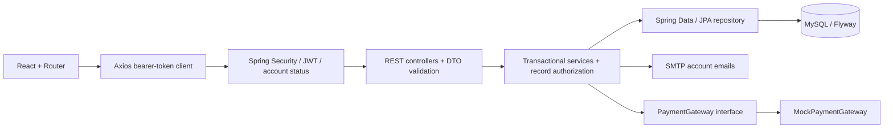

# Architecture

Schoolhouse is a single-school modular monolith. Spring MVC controllers accept
Bean-Validated request records. Services own transactions and enforce roles plus
record ownership. JPA repositories persist entities in MySQL; Flyway owns DDL.
Responses are account DTOs or immutable `View` DTOs containing explicitly selected
scalar fields. Entities, password hashes, token hashes, and document bytes are never
serialized as ordinary JSON responses.

## Module responsibilities

| Package / class | Responsibility |
|---|---|
| `identity` | Accounts, roles, JWT issuance, verification/reset tokens and profile lifecycle |
| `config` | JWT decoder/encoder, security chain, CORS, BCrypt, administrator bootstrap and rate limiting |
| `school.service.SchoolAccess` | Student, class, offering and messaging authorization |
| `PeopleService` | Student, guardian, teacher and staff profiles |
| `AcademicService` | Academic years, terms, classes, subjects, offerings, schedules and enrollment |
| `LearningService` | Assignments, text submissions, marks, attendance, materials and academic audit records |
| `BillingService` | Fee structures, invoice snapshots, balances, mock payment transactions and receipts |
| `CommunicationService` | Announcements, notifications, messages and events |
| `ReportService` | Role-scoped dashboard aggregates, report cards and CSV exports |

## Authorization matrix

| Role | Allowed operations |
|---|---|
| Administrator | All school modules; account provisioning, activation and roles; guardian approval |
| Teacher | Assigned classes/students; write marks and materials for their own offerings; class attendance; assigned-class announcements; permitted parent/admin messaging |
| Parent | Own profile and verified children's academic/fee records; submit child registrations; mock payments; permitted teacher messaging |
| Student | Own academic/fee records; text submissions for their enrolled class |
| Accountant / school staff | Billing, reports about billing, and student/class identification for billing; no academic writes, marks or account administration |

A role alone never authorizes a parent to read a student. Verified guardian links
are required. A shared student does not extend a teacher's class assignments.
Object IDs are checked by services; out-of-scope records generally return 404.
Administrator-created parent links are verified; parent-submitted links remain
unverified until administrator approval. Students may exist without login accounts.

## Authentication

Passwords use BCrypt with cost 12 and a 72-byte UTF-8 limit. JWTs use HS256 with a
required secret of at least 32 random bytes, issuer `school-management`, audience
`school-api`, a subject user ID, and a 30-minute expiration. Spring Security/Nimbus
validates signatures and standard claims. Every request also checks the live user's
activation, verification, roles and token version. Logout, resets, password changes,
and access changes revoke prior tokens via that version.

Public registration always creates a parent account; client-supplied role values
cannot elevate it. Privileged accounts are administrator-provisioned. Initial admin
bootstrap is environment-controlled and runs only on an empty users table.
Verification/reset secrets are random, hash-only at rest, expire in 30 minutes, and
are consumed under a row lock. Verification never reverses administrator deactivation.
Reset/verification requests use generic success messages for unknown emails.

React stores access tokens in memory. Routes are guarded for navigation, while the
backend remains authoritative. CORS accepts exactly one configured frontend origin.
No authentication cookies are used, so the API does not rely on cookie-based CSRF
protection. The authentication endpoint limiter allows 60 requests/minute per remote
address per API process; reverse-proxy replicas need a shared limiter and an explicit
trusted-proxy policy before scaling.

## Business invariants

- One active class enrollment per student per academic year; class capacity is
  checked under a lock. Enrollment withdrawal retains the record.
- A term lies inside its year. Class year and offering class/subject cannot be
  reassigned by an edit. Timetables reject overlapping teacher, room or class slots.
- Grades belong to enrolled students and the teacher's offering. `0 <= score <= maximum`;
  maximum and weight must be positive. Subject averages group by offering and term
  and weight normalized percentages. Overall average equally weights those groups.
  A/B/C/D/F thresholds are 90/80/70/60. Missing marks remain ungraded, not zero.
- Attendance is unique by student/class/date and supports present, absent, late,
  excused. Dates must be within the academic year and cannot be in the future.
- Invoices snapshot one fee's description, amount and currency. Later fee changes do
  not change existing invoices. Balances subtract successful payments from invoice
  amounts. Currency totals remain separate.
- Payment mutations lock invoices, reject overpayment, and require unique idempotency
  keys. Payment and immutable receipt creation share one database transaction. The
  mock gateway is deterministic by idempotency key and never handles card information.
- Parents can message their enrolled children's teachers; teachers can message school
  administrators. Conversation history is visible only to the two participants.
- Materials are limited to 10 MB and a PDF/text/PNG/JPEG allowlist, stored privately in
  the database, and downloaded as attachments after authorization.

## Portfolio scope and extension points

This is a runnable portfolio application, not an audited production school platform.
The following implementation choices are deliberate and visible:

- Collections are authorized and filtered in services before pagination; most domain
  associations are eagerly loaded. This prioritizes explicit behavior in this small
  application. Move scope predicates, filtering and pagination into repository queries
  and projections before using large datasets. Account search already uses DB pagination.
- The five role capabilities are defined in code. Role assignment is editable, but the
  reserved permissions tables are not a dynamic policy editor.
- Report cards and receipts are downloadable text; reports export CSV. PDF/Excel,
  profile photos, SMS, malware scanning and a dedicated document storage service are
  optional extensions not included in this version.
- Assignment submissions are text. Late submissions are rejected; extensions and
  multi-file student submissions need additional workflow rules.
- Events form a single school calendar. Academic years and terms are separate entities;
  multi-calendar sharing and recurrence are not included.
- Logout/password changes revoke all of a user's current tokens. Refresh tokens,
  per-device sessions and persistent browser login are not included.
- Email is synchronous SMTP for account flows; announcements create in-app
  notifications. Add an outbox/worker for reliable asynchronous email/SMS notifications.
- Production payment adapters must use hosted checkout and authenticated, idempotent
  webhooks; do not substitute a real network charge into the mock transaction directly.
- Academic and billing audit records are included; a complete compliance audit trail,
  backups, TLS termination and operational monitoring are deployment responsibilities.

Official references: [Spring Security JWT](https://docs.spring.io/spring-security/reference/6.5/servlet/oauth2/resource-server/jwt.html),
[Spring Boot Java requirements](https://docs.spring.io/spring-boot/3.5/system-requirements.html),
[Vite prerequisites](https://vite.dev/guide/).
