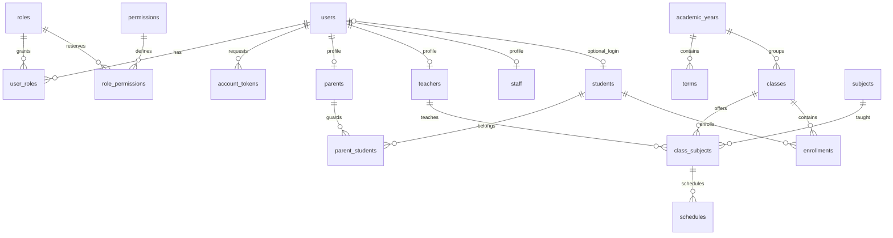
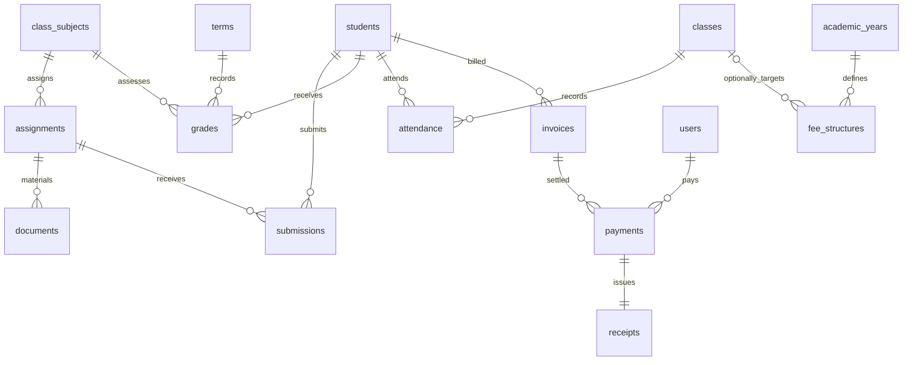
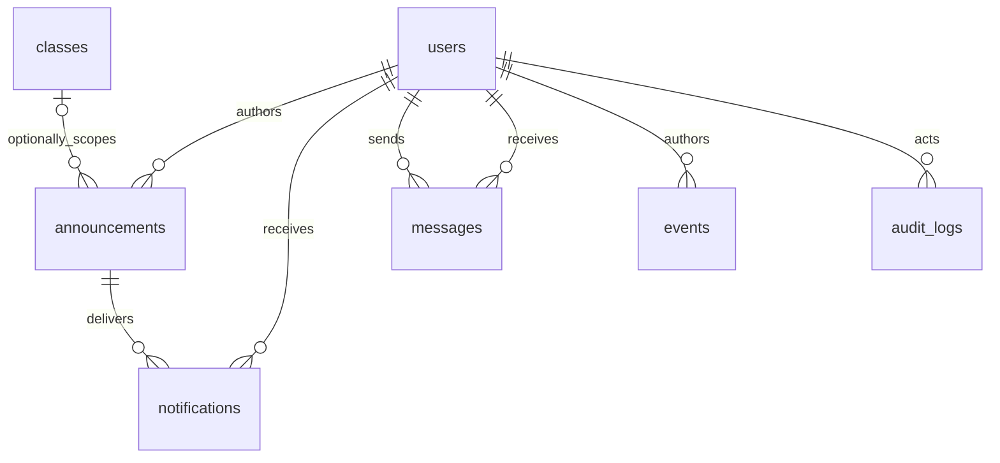

# Database design

The executable schema is in:

- `backend/src/main/resources/db/migration/V1__identity_and_school_structure.sql`
- `backend/src/main/resources/db/migration/V2__school_modules.sql`

Flyway applies migrations in order. Hibernate validates mappings with
`ddl-auto=validate`; it does not modify the schema. Primary keys are generated BIGINT
IDs. Relationships use foreign keys; deleting referenced historical data is restricted.
Amounts use `DECIMAL(12,2)` and an explicit currency. Dates describe local school days;
UTC instants describe login, payment, messaging and event timestamps.

## Identity and enrollment

Students may have multiple guardians. Parent profiles are automatically created
with parent accounts; employee profiles are explicitly linked to their accounts.
Student identity is independent of login identity so young children need no account.
A class is an annual section, such as Grade 5A in 2026–2027. Subject offerings link
that section to a subject and its assigned teacher. Enrollments retain class history.
Guardian links are a composite-key join table with relationship and verification.

Unique constraints cover email, user/profile association, student and employee
numbers, year name, subject code, class/year name, term/year name, class/subject,
and student/class enrollment. Check constraints enforce date ordering, valid student
statuses and positive class capacity. Indexes support student-name lookups; MySQL
also indexes foreign keys.

The five seeded roles are `ADMINISTRATOR`, `TEACHER`, `PARENT`, `STUDENT`, and
`ACCOUNTANT`. The permissions and role-permissions tables are reserved for future
custom policy administration; current role capabilities are enforced in services.

## Learning and billing

| Table | Notable fields and constraints |
|---|---|
| `assignments` | Offering FK, title, instructions, deadline |
| `documents` | Assignment/uploader FKs, filename, media type, private BLOB, upload timestamp |
| `submissions` | Unique assignment/student; text body and submitted timestamp |
| `grades` | Student/offering/term/author FKs; type, title, score, maximum, weight, optimistic version; unique student/offering/term/type/title |
| `attendance` | Unique student/class/date; present, absent, late or excused; author FK |
| `fee_structures` | Academic year and optional class; name, amount, currency |
| `invoices` | Student FK, unique invoice number; immutable description/amount/currency snapshot, due date and optimistic version |
| `payments` | Invoice/payer FKs, amount, currency, success status, timestamp; unique idempotency key and provider reference |
| `receipts` | Unique payment FK and receipt number; issued timestamp |

Each invoice currently represents one fee. There is no redundant stored balance:
balance equals invoice amount minus successful payments. Multi-line invoice items
and credit notes are future extensions. A grade stores its assessment details as an
individual mark; a reusable assessment catalog is not part of this implementation.

## Communications, calendar and auditing

Announcements may be school-wide or class-specific. Notifications are unique per
recipient/announcement and retain read timestamps. Messages store sender and recipient
FKs; conversation history is their ordered message exchange, with a recipient read
timestamp. Events form one school calendar and store category, start/end and all-day
state. Audit rows identify the actor, action, resource and time without storing secrets.
Recipient/time, sender/time, event-start and audit-time indexes support common reads.

## Rules requiring transactions/services

Cross-table rules cannot all be expressed as simple foreign keys: profile roles,
verified guardian access, teacher scope, term/year boundaries, class capacity,
active enrollment uniqueness, schedule overlap and payment balance checks live in
transactional services. Invoice and enrollment changes use row locks where needed;
unique constraints provide a final defense against duplicate records.
